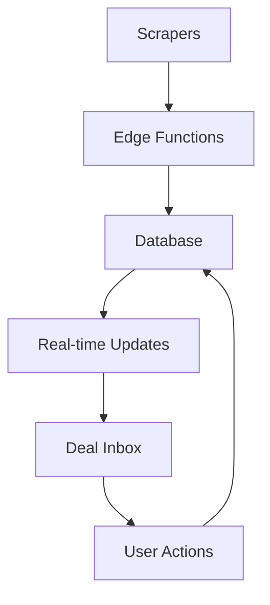

# DealerScope - Vehicle Arbitrage Platform

A production-ready FastAPI application for intelligent vehicle arbitrage analysis.

**Status**: Refactored for production deployment with Docker support.

## Quick Start

### Docker (Recommended)

```bash
# Clone and start with Docker Compose
git clone <repository>
cd dealerscope
docker-compose up --build
```

The API will be available at: http://localhost:8080

## 🛠 Tech Stack

- **Frontend**: React 18 + TypeScript, Tailwind CSS, shadcn/ui
- **Backend**: Supabase (Auth, Database, Edge Functions)
- **Real-time**: WebSocket updates for live deal notifications  
- **Security**: Row Level Security, audit logging, input sanitization
- **Performance**: Query optimization, intelligent caching, circuit breakers

## 📋 Prerequisites

- **Node.js 18+** and npm
- **Supabase Account** (free tier works)
- Modern browser with ES2020+ support

## 📚 Documentation

### Core Documentation
- [API Documentation](README_API.md) - Complete API reference and integration guide
- [Security Guide](README_SECURITY_OPTIMIZATIONS.md) - Security features and best practices
- [Production Readiness](docs/PRODUCTION_READINESS.md) - Production deployment checklist

### Rover Premium Module
- 📋 **[Code Verification Checklist](.github/rover_code_verification.md)** - Pre-deployment verification
- 🧪 **[Testing Guidance](docs/rover_smoke_e2e.md)** - Smoke, E2E, and load testing strategies
- 📊 **[Monitoring & Logging](docs/rover_monitoring_audit.md)** - Observability and metrics setup
- 📖 **[Documentation Review](docs/rover_docs_review.md)** - Documentation standards and checklists
- 🎯 **[Retrospective Templates](docs/rover_retro_agenda.md)** - Post-launch review processes
- ⚡ **[Code Snippets](docs/rover_snippets.md)** - Production-ready utilities and patterns

## 🔧 Setup

### 1. Environment Configuration

```bash
# Copy environment template
cp .env.example .env

# Edit with your Supabase credentials
nano .env
```

Required environment variables:
```bash
VITE_SUPABASE_URL=your-supabase-url
VITE_SUPABASE_ANON_KEY=your-anon-key
```

### 2. Database Setup

The database schema is automatically created when you first run the app. Tables include:
- `public_listings` - Scraped vehicle data
- `opportunities` - Analyzed arbitrage opportunities  
- `user_settings` - User preferences
- `security_audit_log` - Security events

### 3. Development Commands

```bash
# Start development server
npm run dev
# or
bash scripts/dev.sh

# Run tests
npm test

# Type checking
npm run type-check

# Build for production
npm run build
```

## 🏗 Architecture

### Core Components

```
src/
├── components/         # UI components
│   ├── DealInbox.tsx  # Main deal management interface
│   ├── DealCard.tsx   # Individual deal display
│   └── ui/            # shadcn/ui components
├── pages/
│   ├── Index.tsx      # Main dashboard
│   └── Settings.tsx   # User preferences
├── hooks/
│   ├── useRealtimeOpportunities.ts  # WebSocket integration
│   └── useSecureStorage.ts          # Encrypted local storage
├── services/
│   └── api.ts         # Supabase integration layer
└── utils/
    ├── performanceOptimizer.ts  # Performance monitoring
    └── securityHeaders.ts       # Security hardening
```

### Data Flow



## 🎮 Usage Guide

### Deal Inbox Workflow

1. **Open** DealerScope - see your deal inbox with New/Watching/Dismissed
2. **Configure** sources & filters in Settings (GovDeals, PublicSurplus, etc.)
3. **Scan** manually or let background scans run every 10 minutes
4. **Review** deals with profit/risk badges and market analysis
5. **Act** on opportunities - Watch, Hide, or Open auction

### Key Features

- **🔴 Red Bubble Alerts**: New high-profit deals appear instantly
- **📱 Mobile PWA**: Full functionality on mobile devices
- **🔒 Secure**: Enterprise-grade security with audit logging
- **⚡ Fast**: Optimized queries and intelligent caching
- **🎯 Smart Filtering**: ROI, risk score, location, make/model

## 🔐 Security Features

DealerScope v4.9 includes enterprise-grade security:

- ✅ **Authentication**: JWT + TOTP two-factor authentication
- ✅ **Authorization**: Row Level Security for all data access
- ✅ **Input Validation**: Comprehensive sanitization and validation
- ✅ **SSRF Protection**: Domain allowlisting for scraper requests
- ✅ **Audit Logging**: Complete security event tracking
- ✅ **Rate Limiting**: Protection against abuse
- ✅ **CSP Headers**: XSS and injection protection
- ✅ **Encrypted Storage**: Sensitive data encryption at rest

## 🧪 Testing

```bash
# Run all tests
npm test

# Run specific test suites
npm run test:unit        # Unit tests
npm run test:integration # Integration tests
npm run test:security    # Security tests

# Coverage report
npm run test:coverage
```

### Test Categories

- **Unit Tests**: Component logic, utilities, calculations
- **Integration Tests**: API interactions, database operations
- **Security Tests**: Input validation, authentication flows
- **Contract Tests**: API response shapes and schemas

## 📊 Performance Monitoring

Built-in performance monitoring includes:

- **Memory Usage**: Automatic cleanup and garbage collection
- **API Response Times**: Circuit breakers for resilience  
- **Cache Hit Rates**: Intelligent caching strategies
- **Error Tracking**: Comprehensive error reporting

## 🚀 Validation Dashboard (GitHub Pages)

DealerScope includes a comprehensive validation dashboard deployed via GitHub Pages:

- **📋 Live Dashboard**: Real-time production readiness reports
- **🔄 Auto-Updates**: Daily validation runs at 6 AM UTC
- **📊 Multi-Category**: Security, performance, resilience, observability
- **📱 Mobile-Friendly**: Responsive design for all devices

### Access the Dashboard

```bash
# View live reports (after GitHub Pages setup)
https://[username].github.io/[repository]/

# Run validation locally
./scripts/run-validation-suite.sh

# Manual deployment trigger
gh workflow run deploy-validation-reports.yml
```

### Available Reports
- **Security**: Vulnerability scans, auth testing, RLS validation
- **Performance**: Load testing, bundle analysis, DB optimization  
- **Resilience**: Chaos engineering, circuit breaker testing
- **Observability**: Logging, metrics, distributed tracing
- **CI/CD**: Pipeline health, test coverage, deployments
- **Frontend**: Lighthouse scores, accessibility, SEO

See [Validation Dashboard Guide](docs/VALIDATION_DASHBOARD.md) for complete documentation.

## 🚦 Security Hardening

### Production Checklist

- [ ] Set up proper environment variables
- [ ] Configure Row Level Security policies
- [ ] Enable audit logging
- [ ] Set up backup procedures
- [ ] Configure rate limiting
- [ ] Review user permissions
- [ ] Test authentication flows
- [ ] Validate input sanitization

### Security Scan

```bash
# Run security audit
npm run security:audit

# Check dependencies
npm audit

# Validate configuration
npm run config:validate
```

## 🤝 Contributing

### Adding New Auction Sites

1. **Add site configuration** in `src/types/scraper.ts`
2. **Implement scraper** in `supabase/functions/vehicle-scraper/`
3. **Add CSS selectors** for data extraction
4. **Test with sample data**
5. **Update documentation**

### Development Guidelines

- **Security First**: All features must pass security review
- **Performance**: Optimize for mobile and low-bandwidth
- **Testing**: Maintain >90% test coverage
- **Documentation**: Update docs with any API changes

## 🤖 Rover Premium Intelligence Engine

DealerScope includes **Rover**, an advanced ML-powered premium module that provides intelligent vehicle arbitrage recommendations and analytics.

### Rover Features
- ✅ **ML-Powered Recommendations**: Advanced machine learning for high-value opportunity identification
- ✅ **Real-time Scoring**: Dynamic arbitrage and ROI scoring with confidence metrics
- ✅ **User Preference Learning**: Personalized recommendations based on interaction history
- ✅ **Premium Analytics**: Advanced performance tracking and conversion analytics
- ✅ **Risk Assessment**: Intelligent risk profiling and tolerance matching

### Rover Documentation & Templates
- 📋 **[Code Verification Checklist](.github/rover_code_verification.md)** - Comprehensive pre-deployment verification
- 🧪 **[Smoke & E2E Test Guidance](docs/rover_smoke_e2e.md)** - Testing strategies with Vitest, Playwright, and k6
- 📊 **[Monitoring & Logging Audit](docs/rover_monitoring_audit.md)** - Prometheus/Grafana setup and observability
- 📖 **[Documentation Review Checklist](docs/rover_docs_review.md)** - Complete documentation standards and review process
- 🎯 **[Post-Launch Retrospective](docs/rover_retro_agenda.md)** - Retro agenda and survey templates
- ⚡ **[Code Snippets & Utilities](docs/rover_snippets.md)** - Ready-to-use Redis, ML, monitoring, and testing utilities

### Getting Started with Rover
1. **Premium Subscription**: Rover features require premium subscription
2. **Navigate to Rover**: Access via premium dashboard or `/rover` route
3. **Set Preferences**: Configure search criteria and risk tolerance
4. **Generate Recommendations**: Get ML-powered vehicle recommendations
5. **Track Performance**: Monitor ROI and conversion analytics

## 📈 Roadmap

### v5.0 Features
- [ ] Enhanced ML models with deeper market analysis
- [ ] Advanced market analytics and trends
- [ ] Automated bidding capabilities
- [ ] Enhanced mobile app with offline support
- [ ] Integration with dealer management systems

### Performance Targets
- [ ] <500ms average page load time
- [ ] <100ms API response times  
- [ ] 99.9% uptime SLA
- [ ] Support for 10,000+ concurrent users

## 🔧 Troubleshooting

### Common Issues

**Build Errors**
```bash
# Clear node_modules and reinstall
rm -rf node_modules package-lock.json
npm install
```

**Database Connection Issues**
```bash
# Check Supabase credentials in .env
# Verify network connectivity
# Check Supabase dashboard for service status
```

**Authentication Problems**
```bash
# Clear browser storage
# Check JWT token expiration
# Verify user permissions in Supabase
```

### Debug Mode

```bash
# Enable debug logging
DEBUG=dealerscope:* npm run dev

# Verbose error reporting
NODE_ENV=development npm run dev
```

## 📞 Support

- **Documentation**: Full API docs at `/docs`
- **Issues**: GitHub Issues for bug reports
- **Security**: Report security issues privately
- **Community**: Discord server for discussions

## 📄 License

**MIT License** - see [LICENSE](LICENSE) for details

---

**Built with ❤️ for the vehicle arbitrage community**

*DealerScope v4.9 - Production-ready, secure, and blazingly fast.*